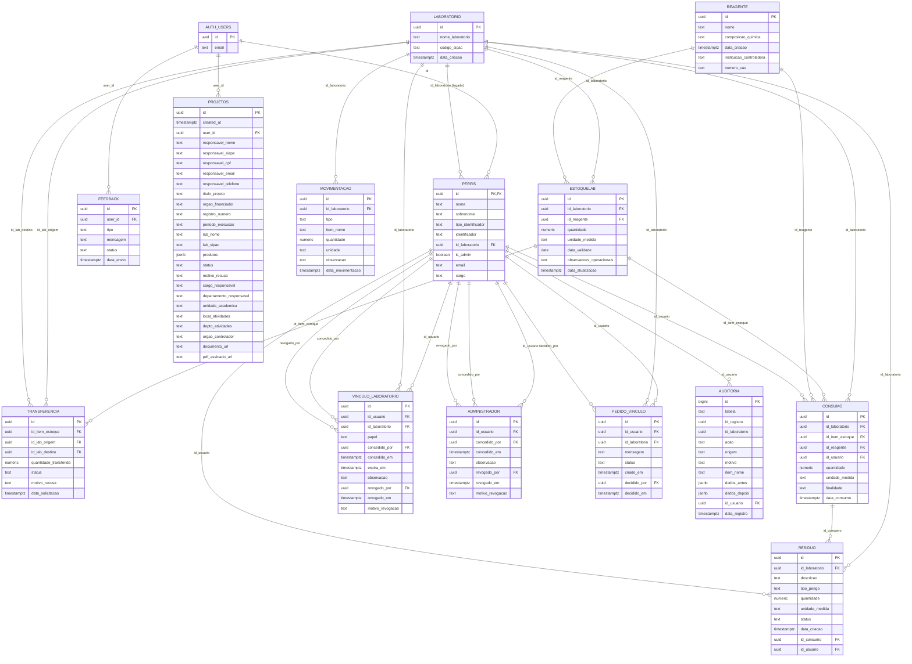

# Diagrama entidade-relacionamento

Tabelas do schema `public` criadas pelas migrations de `supabase/migrations/`. Este arquivo
é a única fonte do diagrama: ao criar ou alterar uma tabela numa migration, atualize-o no
mesmo PR. O GitHub desenha o Mermaid direto na página.

- `perfis.id_laboratorio` e `perfis.is_admin` são legados; o acesso vem de
  `vinculo_laboratorio` e `administrador`.
- `auditoria.id_registro` e `auditoria.id_laboratorio` não têm FK de propósito: o registro
  continua existindo depois que o item ou o laboratório é excluído.
- `pedido_vinculo` está preparada para uma próxima etapa e ainda não é usada.

